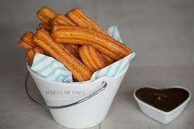

# Churros recept

## Ingrediëntenlijst

1. 160 ml melk
2. 160 ml water
3. 50 gr suiker
4. 50 gr boter
5. ¼ tl zout
6. 200 gr bloem
7. 2 eieren
8. Voor de kaneelsuiker
9. 250 gr suiker
10. 2½ tl kaneel

## Churros maken

### Verwarm de olie voor op 180 °C in een frituurpan of grote gietijzeren pan.

### Doe de melk en het water met de suiker, boter en het zout in een pan en breng dit aan de kook. Haal als het mengsel kookt de pan van het vuur en voeg in één keer de bloem toe. Roer goed door tot een stevige bal deeg. Laat het deeg ongeveer 10 minuten afkoelen.

### Roer daarna de eieren één voor één door het deeg tot ze helemaal opgenomen zijn. Doe het deeg in een spuitzak met een gekarteld spuitmondje van 7-10 millimeter doorsnede.

## Churros bakken

### Spuit slierten van het deeg boven de hete olie en knip of snijd deze om de 10-14 centimeter af. Bak de churros in 3 tot 6 minuten goudbruin en gaar. Haal de churros met een schuimspaan of tang uit de olie en laat ze kort uitlekken op keukenpapier.

### Meng in een diep bord de suiker met de kaneel en wentel de warme churros door de kaneelsuiker. Serveer de churros zo vers mogelijk en met de warme chocoladesaus.

### Tip: In plaats van de slierten deeg te knippen, kun je ook een dun ijzerdraadje spannen tussen de twee handvaten van de pan waarin je de churros bakt. Als de sliert lang genoeg is, haal je het spuitmondje langs de draad om de sliert af te snijden. 
